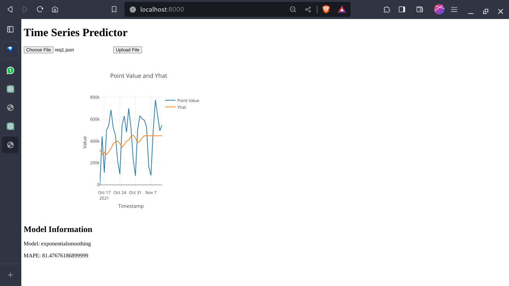

# datagenie-classifier
the data folder contains the data files 
the src folder contains the files for the flask server that runs the app 
run - python3 src/app.py to get it started 
the website folder contains the website and u can run the index.html and upload file in that and it will give tge plot 
i have attached a sample image called webage+demo1.png that shows the same webpage looks so far 
i will attach it here

