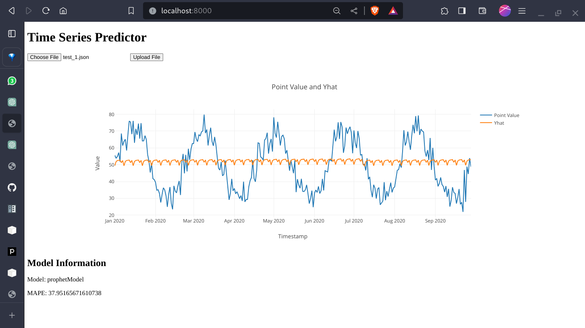

# Time Series Classifier


## Table of Contents
1. [Introduction](#introduction)
2. [Data](#data)
    - [Data Subdivisions](#data-subdivision)
    - [Data Formats](#generated-data)
    - [Test Data](#test-data)
3. [Images](#images)
4. [Scripts](#scripts)
    -[Flask app](#apppy)
5. [Usage](#usage)

## Introduction
Classifier built to identify best time series model that has **REST API** endpoints to drop timeseries.json file in local webapp and get the best time series model fit for it.

## Data
### Data-Subdivision
- `daily`: Data generated on a daily basis.
- `monthly`: Data generated on a monthly basis.
- `hourly`: Data generated on an hourly basis.
- `weekly`: Data generated on a weekly basis.

### Generated Data
Data specifically generated for each particular model using scripts in `src/generate_data`.

### Test Data
Contains CSV and JSON files corresponding to the generated data. The JSON files need to be uploaded to the website, as illustrated in the website image.
### Trained Parameters.csv
The features on which the data was trained are stored in `train_params.csv`.


## Images
Contains images examples of how the website on a dataset drop looks like 
`images/tree2.png` is an example of how the trained classifier looks like

## Scripts
only the essential scripts to run are explained in this portion
### generate_data
scripts in this folder are to generate data ie timeseries that we got in the data/generate folder that favours that particular time series 

### models
these are the 4 time series class models arima,exps,lstm,prophet

### app.py 
is the flask server with the endpoint /predict which is asked in checkpoint 3

### classifier_model.py 
assumes that we have the trained label data on the parameters_train.csv we run this file to create the classifier model 

### classifier.py 
this is to create the parameters_train csv from the datasets ie the training of all files happens here 
this takes a lot of time atleast 3/4 hours if you want to train all data at one go.


## Usage
``````
python3 src/app.py 
``````
This is to host the flask server and the port where the server is running must be provided to where the website is running in the web/script.js file.
